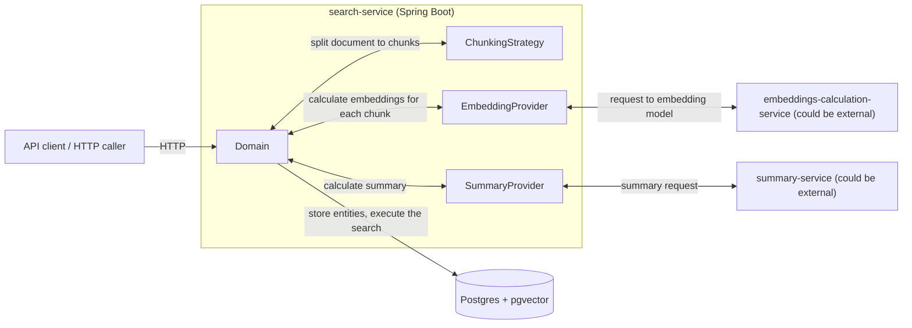
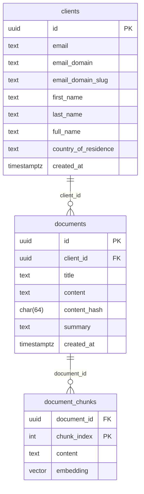
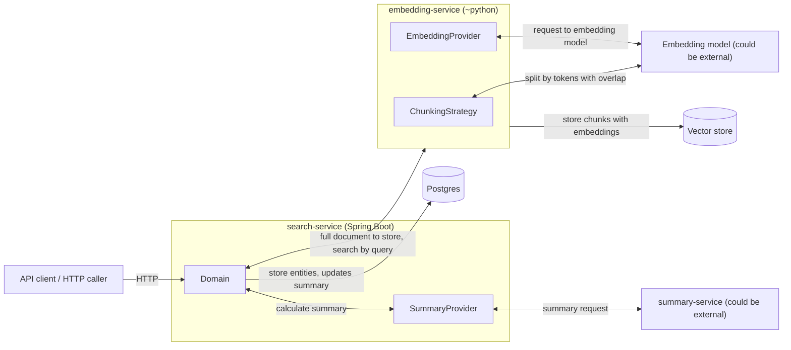

# Search Service

First of all, I don't recommend to run docker compose locally as it takes (including both models) about ~45 GB of disk space... This is my first time trying to run the models anywhere, there might be more appropriate models or other ways...

So, I deployed it for you by the link: http://34.175.18.120:8080/swagger-ui/index.html#/

More details in the [section below](#5-how-to-reproduce)

## 1. Overview

### 1.1 Problem Statement

The goal of this project is to provide a backend service that allows advisors to:

- Register clients and attach documents to them (e.g. KYC documents, notes, reports).
- Search for clients by free-text queries (name, email, or company-like terms).
- Search for documents by meaning, not just exact words (e.g. a search for “proof of address” should also surface documents that talk about “utility bills” or “council tax bills”).

The service exposes a small HTTP API and persists all data in Postgres. It combines:

- **Lexical search** (for client discovery).
- **Semantic search** based on text embeddings (for document discovery and “similar meaning” queries) and **lexical search** for exact matches.

### 1.2 High-level Solution Approach

At a high level, the system works as follows:

- **Data storage**
  - All structured data (clients, documents, document chunks) is stored in **Postgres**.
  - Document chunks also store an **embedding vector** column using `pgvector`, so semantic search can be executed directly inside Postgres.
  - Documents are stored as text, alongside metadata such as title, client reference and a content hash.

- **Embedding generation**
  - When a document is ingested, the service:
    - Splits the content into **chunks** (paragraph-oriented with a configurable maximum size).
        - In a production/target state, chunking should be performed on _a token-based window with a small configurable overlap_ between chunks to preserve context across boundaries.
    - Sends each chunk to an **embedding provider** over HTTP.
    - Receives back a numeric vector for each chunk and stores it in Postgres.
  - The embedding provider is pluggable:
    - In local/dev mode this can be a locally running model.
    - In a production-like setup this would typically call a managed LLM/embedding API.
  - For queries, the same provider is used to embed the search phrase before performing semantic search.

- **Client search (lexical)**
  - Client ingestion lowercases the email, splits out `email_domain` and a dotless `email_domain_slug`, and persists a denormalised `full_name` to make domain and name matching cheap.
  - Client search is implemented as a **lexical search** over the main client table.
  - The query is normalised and interpreted heuristically:
    - It may be treated as an email, domain-like string, or name.
  - Postgres trigram similarity search is used to find matching clients and rank them in a sensible order.

- **Document search (semantic)**
  - Semantic search:
    - Embeds the user’s query into a vector.
    - Uses `pgvector`’s distance operator (cosine distance) to find the nearest chunk embeddings in Postgres.
    - Aggregates results per document and returns:
      - Document metadata (title, client, timestamps).
      - The best-matching chunk content as context.
      - A similarity score derived from the embedding distance and, if desired, lexical signals.
  - Lexical search:
    - Performs `ILIKE` substring checks and trigram `similarity` against chunk text (filtered by `search.threshold.similarity`), keeps the best chunk per document via `ROW_NUMBER`, and orders matches by exact substring hits first and similarity score next.

- **Summaries**
  - Summaries are generated on demand because LLM calls are relatively expensive. When a summary is first requested (via introduced document-by-id endpoint), the service calls the summarisation provider, stores the result in the database, and returns it with the document.

  - In the current implementation documents are immutable, so summaries never need updates. In a target state with editable documents, each document would store a content hash; if the hash changes, the existing summary would be invalidated and regenerated on the next request.

- **Current vs target state**
  - **Current implementation**: everything (entities + embeddings) is stored in a single Postgres instance using `pgvector`. This keeps the system simple and easy to run.
  - **Target/scale-out design**: embeddings and search indices can be moved into a **dedicated vector database**. Chunking and semantic search part can be isolated to a different service, clearly separating “transactional entities” and “semantic index”.

## 3. Architecture

### 3.1 Current state architecture

Overall schematic diagram

Database model

### 3.2 Repository structure

- `search-service/` – Java Spring Boot backend with API, persistence, and search logic.
- `embeddings-calculation-service/` – FastAPI service that generates embeddings for chunks/queries used for local/dev flows.
- `summary-service/` –  FastAPI summarisation service used for local/dev flows.
- `devops/` – docker-compose and supporting infra files for local development.
- `docs/` – design and architecture documentation for agents.

### 3.3 Target State Architecture

In a target/production state, the architecture evolves towards clearer separation of responsibilities and independent scaling of the main data store and the semantic index:

- **Separation of OLTP store and vector store**  
  - The primary OLTP database continues to store clients, documents, metadata and summaries (e.g. Postgres).
  - Chunking and embedding calculation (as they are connected) is moved to a dedicated service that calculates and stores embeddings and indices into a **dedicated vector store** (or search engine) optimised for ANN search (e.g. HNSW, IVF, etc.).
  - The search-service then:
    - Uses the dedicated service for nearest-neighbour retrieval by the query string (clearly separating itself from embedding and vectors concept).
    - Hydrates document IDs back from the OLTP store to return full document metadata.

## 4. Technology and Requirements

### 4.1 Languages and Runtimes
- Java 25
- Python 3.13
- Docker 29

### 4.2 External Services and Configuration

- Embedding provider HTTP endpoint
- Summary provider HTTP endpoint

Within repository there are local options for both services, but with limited capabilities, not intended to be used in production.

Also, for testing, you may provide your own endpoints and tokens, check below.

## 5. How to Reproduce

### 5.1 Run Modes (Docker compose)
- `docker compose -f devops/local/docker-compose.yml --profile all up -d` – starts Postgres, embeddings, summary, and the search-service wired to both local services.
- `docker compose -f devops/local/docker-compose.yml --profile embed up -d` – starts Postgres, embeddings, and the search-service configured to call the local embedding service with summary mocked.
- `docker compose -f devops/local/docker-compose.yml --profile external up -d` – starts Postgres and the search-service expecting external embedding/summary endpoints provided via environment variables.

### 5.3 Examples of queries
/////todo

## 6. Trade-offs

### 6.1 Storage and Indexing

- **Single Postgres instance (current)**  
  - Pros: simple to operate, one source of truth, easy to run via Docker, straightforward transactions between entities and embeddings.  
  - Cons: ties OLTP and search workloads together, limited room to tune storage/indices independently, less flexible at very large scale.

- **Separate vector store (target)**  
  - Pros: can scale semantic search independently, use ANN-specific features (HNSW, optimized recall/latency), and offload heavy vector queries from the main database.  
  - Cons: added operational complexity (two datastores, async sync/ETL), more moving parts and failure modes.

### 6.2 Chunking approach

- Current implementation uses paragraph-oriented chunks with a configurable maximum size, which is simple and good enough for the exercise.  
- A token-based sliding window with overlap is more robust for production: it preserves context across chunk boundaries and avoids very uneven chunk sizes.

### 6.3 Embedding and Summarisation Providers

- **Summarisation cost model**  
  - Summaries are generated on demand and cached, trading extra code complexity for predictable and controllable LLM usage.  
  - Eager summarisation at ingestion would simplify retrieval but can be wasteful if many documents are never viewed.

- **Testing and determinism**  
  - Both embedding and summarisation providers are abstracted behind interfaces so that tests can use deterministic mocks instead of hitting real models.  
  - This keeps the test suite fast, repeatable and free from external API costs.
